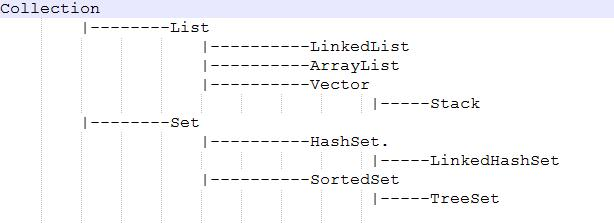

**Java面试基础(一)**　　**2017年4月6日**　　**天气：多云**  
**1.ArrayList、LinkedList、Vector的区别**  
先看一下继承关系：  
  
可以看到ArrayList,LinkedList,Vector都实现了List的接口。下面具体说明下：  
**1)ArrayList** 
```Java
public class ArrayList extends AbstractList implements List, RandomAccess, Cloneable, Serializable
```     
ArrayList是List接口的**大小可变数组**的实现。实现了所有可选列表操作，并**允许包括null在内的所有元素**。除了实现List接口外，此类还提供一些方法来操作内部用来存储列表的数组的大小。（此类大致上等同于Vector类，除了**此类是不同步的**。）  
每个 ArrayList 实例都有一个容量。该容量是指用来存储列表元素的数组的大小。它总是至少等于列表的大小。随着向 ArrayList 中不断添加元素，其容量也自动增长。并未指定增长策略的细节，因为这不只是添加元素会带来分摊固定时间开销那样简单。  
在添加大量元素前，应用程序可以使用 ensureCapacity 操作来增加 ArrayList 实例的容量。这可以减少递增式再分配的数量。  
```Java
 List list = Collections.synchronizedList(new ArrayList(...));
```
此类的 iterator 和 listIterator 方法返回的迭代器是快速失败的：在创建迭代器之后，除非通过迭代器自身的 remove 或 add 方法从结构上对列表进行修改，否则在任何时间以任何方式对列表进行修改，迭代器都会抛出 ConcurrentModificationException。因此，面对并发的修改，迭代器很快就会完全失败，而不是冒着在将来某个不确定时间发生任意不确定行为的风险。 注意，迭代器的快速失败行为无法得到保证，因为一般来说，不可能对是否出现不同步并发修改做出任何硬性保证。快速失败迭代器会尽最大努力抛出 ConcurrentModificationException。因此，为提高这类迭代器的正确性而编写一个依赖于此异常的程序是错误的做法：迭代器的快速失败行为应该仅用于检测 bug。  
**2)LinkedList**  
```Java
public class LinkedList extends AbstractSequentialList implements List, Deque, Cloneable, Serializable
```
LinkedList是List接口的链接列表实现。实现所有可选的列表操作，并且允许所有元素（**包括 null**）。除了实现 List 接口外，LinkedList 类还为在列表的开头及结尾 get、remove 和 insert 元素提供了统一的命名方法。这些操作允许将链接列表用作堆栈、队列或双端队列。  
此类实现 Deque 接口，为 add、poll 提供先进先出队列操作，以及其他堆栈和双端队列操作。  
所有操作都是按照**双重链接列表**的需要执行的。在列表中编索引的操作将从开头或结尾遍历列表（从靠近指定索引的一端）。  
注意，此实现**不是同步**的。如果多个线程同时访问一个链接列表，而其中至少一个线程从结构上修改了该列表，则它必须 保持外部同步。（结构修改指添加或删除一个或多个元素的任何操作；仅设置元素的值不是结构修改。）这一般通过**对自然封装该列表的对象进行同步操作来完成**。如果不存在这样的对象，则应该使用 Collections.synchronizedList 方法来“包装”该列表。最好在创建时完成这一操作，以防止对列表进行意外的不同步访问，如下所示：  
```Java
List list = Collections.synchronizedList(new LinkedList(...));
```
此类的 iterator 和 listIterator 方法返回的迭代器是快速失败 的：在迭代器创建之后，如果从结构上对列表进行修改，除非通过迭代器自身的 remove 或 add 方法，其他任何时间任何方式的修改，迭代器都将抛出 ConcurrentModificationException。因此，面对并发的修改，迭代器很快就会完全失败，而不冒将来不确定的时间任意发生不确定行为的风险。  
注意，迭代器的快速失败行为不能得到保证，一般来说，存在不同步的并发修改时，不可能作出任何硬性保证。快速失败迭代器尽最大努力抛出 ConcurrentModificationException。因此，编写依赖于此异常的程序的方式是错误的，正确做法是：迭代器的快速失败行为应该仅用于检测程序错误。  
**3)Vector**  
```Java
public class Vector extends AbstractList implements List, RandomAccess, Cloneable, Serializable
```
Vector 类可以**实现可增长的对象数组**。与数组一样，它包含可以使用整数索引进行访问的组件。但是，Vector 的大小可以根据需要增大或缩小，以适应创建 Vector 后进行添加或移除项的操作。  
由 Vector 的 iterator 和 listIterator 方法所返回的迭代器是快速失败的：如果在迭代器创建后的任意时间从结构上修改了向量（通过迭代器自身的 remove 或 add 方法之外的任何其他方式），则迭代器将抛出 ConcurrentModificationException。因此，面对并发的修改，迭代器很快就完全失败，而不是冒着在将来不确定的时间任意发生不确定行为的风险。Vector 的 elements 方法返回的 Enumeration 不是 快速失败的。  
注意，迭代器的快速失败行为不能得到保证，一般来说，存在不同步的并发修改时，不可能作出任何坚决的保证。快速失败迭代器尽最大努力抛出 ConcurrentModificationException。因此，编写依赖于此异常的程序的方式是错误的，正确做法是：迭代器的快速失败行为应该仅用于检测 bug。  
从 Java 2 平台 v1.2 开始，此类改进为可以实现 List 接口，使它成为 Java Collections Framework 的成员。与新 collection 实现不同，**Vector 是同步的**。  
**最后总结一下这三者的区别：**  
1)ArrayList 本质上是一个**可改变大小的数组**.当元素加入时,其大小将会动态地增长.内部的元素可以直接通过get与set方法进行访问.元素顺序存储 ,**随机访问很快，删除非头尾元素慢，新增元素慢而且费资源** ,较适用于无频繁增删的情况 ,比数组效率低，如果不是需要可变数组，可考虑使用数组 ,**非线程安全**.  
2)LinkedList 是一个**双链表**,在添加和删除元素时具有比ArrayList更好的性能.但在get与set方面弱于ArrayList. 适用于 ：没有大规模的随机读取，大量的增加/删除操作.**随机访问很慢，增删操作很快**，不耗费多余资源 ,允许null元素,**非线程安全**.  
3)Vector （类似于ArrayList）但其是**同步的**，开销就比ArrayList要大。如果你的程序本身是线程安全的，那么使用ArrayList是更好的选择。 Vector相对于ArrayList在更多元素添加进来时会请求更大的空间。Vector每次请求其大小的双倍空间，而ArrayList每次对size增长50%.  

**2.HashMap和HashTable的区别**  
**(1)HashTable**  
1)Hashtable继承于Dictionary字典，实现Map接口;  
2)键、值都不能是空对象;  
3)多次访问，映射元素的顺序相同;  
4)线程安全;  
5)hash算法 ，Hashtable则直接利用key本身的hash码来做验证;  
6)数据遍历的方式 Iterator （支持fast-fail）和 Enumeration （不支持fast-fail);  
7)缺省初始长度为11，内部都为抽象方法，需要它的实现类一一作自己的实现。 

**备注**：程序在对 collection 进行迭代时，某个线程对该 collection 在结构上对其做了修改，这时迭代器就会抛出 ConcurrentModificationException 异常信息，从而产生 fail-fast。

**(2)HashMap**  
1)HashMap继承于AbstractMap抽象类;  
2)键和值都可以是空对象;  
3)多次访问，映射元素的顺序可能不同;  
4)非线程安全 HashMap可以通过下面的语句进行同步： 
```Java
Map m = Collections.synchronizeMap(hashMap);  
```
5)检测是否含有key时，HashMap内部需要将key的hash码重新计算一边再检测;  
6)数据遍历的方式 Iterator （支持fast-fail）;  
7)缺省初始长度为16，其内部已经实现了Map所需要做的大部分工作， 它的子类只需要实现它的少量方法。     

**3.Hashcode的作用**  
官方定义：hashcode方法返回该对象的哈希码值。支持该方法是为哈希表提供一些优点，例如，java.util.Hashtable 提供的哈希表。 hashCode 的常规协定是： 在 Java 应用程序执行期间，在同一对象上多次调用 hashCode 方法时，必须一致地返回相同的整数，前提是对象上 equals 比较中所用的信息没有被修改。从某一应用程序的一次执行到同一应用程序的另一次执行，该整数无需保持一致。 如果根据 equals(Object) 方法，两个对象是相等的，那么在两个对象中的每个对象上调用 hashCode 方法都必须生成相同的整数结果。  
以下情况不是必需的：  
如果根据 equals(java.lang.Object) 方法，两个对象不相等，那么在两个对象中的任一对象上调用 hashCode 方法必定会生成不同的整数结果。但是，程序员应该知道，为不相等的对象生成不同整数结果可以提高哈希表的性能。 实际上，由 Object 类定义的 hashCode 方法确实会针对不同的对象返回不同的整数。（这一般是通过将该对象的内部地址转换成一个整数来实现的，但是 JavaTM 编程语言不需要这种实现技巧。） 当equals方法被重写时，通常有必要重写 hashCode 方法，以维护 hashCode 方法的常规协定，该协定声明相等对象必须具有相等的哈希码。 
总结如下关键点：  
**(1)**hashCode的存在主要是**用于查找的快捷性**，如Hashtable，HashMap等，hashCode是用来在散列存储结构中确定对象的存储地址的；  
**(2)**如果**两个对象相同**，就是适用于equals(java.lang.Object) 方法，那么**这两个对象的hashCode一定要相同**；  
**(3)**如果对象的equals方法被重写，那么对象的hashCode也尽量重写，并且产生hashCode使用的对象，一定要和equals方法中使用的一致，否则就会违反上面提到的第2点；  
**(4)两个对象的hashCode相同，并不一定表示两个对象就相同**，也就是不一定适用于equals(java.lang.Object) 方法，只能够说明这两个对象在散列存储结构中，如Hashtable，他们“存放在同一个篮子里”。  
可以归纳：**hashCode是用于查找使用的，而equals是用于比较两个对象的是否相等的。**  
**总的来说：**Java中的集合（Collection）有两类，一类 是List，再有一类是Set。前者集合内的元素是有序的，元素可以重复；后者元素无序，但元素不可重复。要想保证元素不重复，可两个元素是否重复应该依据什么来判断呢？这就是Object.equals方法了。但是，如果每增加一个元素就检查一次，那么当元素很多时，后添加到集合中的元素比较的次数就非常多了。也就是说，如果集合中现在已经有1000个元素，那么第1001个元素加入集合时，它就要调用1000次equals方法。这显然会大大降低效率。于是，Java采用了哈希表的原理。哈希算法也称为散列算法，是 将数据依特定算法直接指定到一个地址上。这样一来，当集合要添加新的元素时，先调用这个元素的hashCode方法，就一下子能定位到它应该放置的物理位置上。如果这个位置上没有元素，它就可以直接存储在这个位置上，不用再进行任何比较了；如果这个位置上已经有元素了，就调用它的equals方法与新元素进行比较，相同的话就不存了，不相同就散 列其它的地址。所以这里存在一个冲突解决的问题。这样一来实际调用equals方法的次数就大大降低了，几乎只需要一两次。 所以，Java对于eqauls方法和hashCode方法是这样规定的：  
**1)如果两个对象相同，那么它们的hashCode值一定要相同；**  
**2)如果两个对象的hashCode相同，它们并不一定相同。**    

**4.Map、Set、List、Queue、Stack的特点与用法**  
**(1)Map**  
1)键映射到值的对象。**一个映射不能包含重复的键；每个键最多只能映射到一个值**。  
2)某些映射实现可明确保证其顺序，如 TreeMap 类；另一些映射实现则不保证顺序，如 HashMap 类。  
3)Map中元素，可以将key序列、value序列单独抽取出来。 使用**keySet()抽取key序列**，将map中的所有keys生成一个**Set**。 使用**values()抽取value序列**，将map中的所有values生成一个**Collection**。 为什么一个生成Set，一个生成Collection？那是因为，**key总是独一无二的，value允许重复**。  
**(2)Set**  
1)一个**不包含重复元素的 collection**。更确切地讲，set 不包含满足 e1.equals(e2) 的元素对 e1 和 e2，并且**最多包含一个 null 元素**。  
2)不可随机访问包含的元素;  
3)只能用**Iterator**实现单向遍历;  
4)Set 没有同步方法。  
**(3)List**  
1)可随机访问包含的元素 元素是有序的 可在任意位置增、删元素 不管访问多少次，元素位置不变 允许重复元素 用**Iterator**实现单向遍历，也可用**ListIterator**实现双向遍历。  
**(4)Queue**  
1)Queue使用时要尽量避免Collection的add()和remove()方法，而是要使用**offer()来加入元素，使用poll()来获取并移出元素**。它们的优点是通过返回值可以判断成功与否，add()和remove()方法在失败的时候会抛出异常。 如果要使用前端而不移出该元素，使用element()或者peek()方法。 值得注意的是**LinkedList类实现了Queue接口，因此我们可以把LinkedList当成Queue来用**。  
2)Queue 实现通常不允许插入 null 元素，尽管某些实现（如 LinkedList）并不禁止插入 null。即使在允许 null 的实现中，也不应该将 null 插入到 Queue 中，因为 null 也用作 poll 方法的一个特殊返回值，表明队列不包含元素。  
**(5)Stack**  
1)Stack继承自Vector（可增长的对象数组），也是同步的,它通过五个操作对类 Vector 进行了扩展 ，允许将向量视为堆栈。它提供了通常的 push 和 pop 操作，以及取堆栈顶点的 peek 方法、测试堆栈是否为空的 empty 方法、在堆栈中查找项并确定到堆栈顶距离的 search 方法。  
**用法：**  
**(a)**如果涉及到堆栈、队列等操作，应该考虑用List；   
**(b)**对于需要快速插入，删除元素，应该使用LinkedList；  
**(c)**如果需要快速随机访问元素，应该使用ArrayList。  
**(d)**如果程序在单线程环境中，或者访问仅仅在一个线程中进行，考虑非同步的类，其效率较高。    

**5.Object有哪些公用方法**  
**(1)protected Object clone()** 创建并返回此对象的一个副本。  
**(2)boolean equals(Object obj)** 指示其他某个对象是否与此对象“相等”。  
**(3)protected void finalize()** 当垃圾回收器确定不存在对该对象的更多引用时，由对象的垃圾回收器调用此方法。  
**(4)Class getClass()** 返回此 Object 的运行时类。  
**(5)int hashCode()** 返回该对象的哈希码值。  
**(6)void notify()** 唤醒在此对象监视器上等待的单个线程。  
**(7)void notifyAll()** 唤醒在此对象监视器上等待的所有线程。  
**(8)String toString()** 返回该对象的字符串表示。  
**(9)void wait()** 在其他线程调用此对象的 notify() 方法或 notifyAll() 方法前，导致当前线程等待。  
**(10)void wait(long timeout)** 在其他线程调用此对象的 notify() 方法或 notifyAll() 方法，或者超过指定的时间量前，导致当前线程等待。  
**(11)void wait(long timeout, int nanos)** 在其他线程调用此对象的 notify() 方法或 notifyAll() 方法，或者其他某个线程中断当前线程，或者已超过某个实际时间量前，导致当前线程等待。    

**6.Override和Overload的使用规则和区别**  
**(1)重写(Override)**  
重写是子类对父类的允许访问的方法的实现过程进行重新编写！**返回值和形参都不能改变**。即外壳不变，重写内在实现！重写的好处在于**子类可以根据需要，定义特定于自己的行为**。 也就是说子类能够根据需要实现父类的方法。在面向对象原则里，重写意味着可以重写任何现有方法。  
Java程序**在编译阶段，只是检查参数的引用类型。在运行时，Java虚拟机(JVM)指定对象的类型并且运行该对象的方法**。  
**方法的重写规则：**  
1)**参数列表必须完全**与被重写方法的**相同**；  
2)**返回类型**必须完全与被重写方法的返回类型**相同**；  
3)**访问权限不能比父类中被重写的方法的访问权限更高**。例如：如果父类的一个方法被声明为public，那么在子类中重写该方法就不能声明为protected 或 private。  
4)父类的成员方法只能被它的子类重写。  
5)声明为**final的方法不能被重写**。  
6)声明为**static的方法不能被重写，但是能够被再次声明**。  
7)子类和父类在同一个包中，那么子类可以重写父类所有方法，除了声明为private和final的方法。   
8)子类和父类不在同一个包中，那么子类只能够重写父类的声明为public和protected的非final方法。  
9)重写的方法能够抛出任何非强制异常，无论被重写的方法是否抛出异常。但是，重写的方法不能抛出新的强制性异常，或者比被重写方法声明的更广泛的强制性异常，反之则可以。  
10)**构造方法不能被重写。**  
11)如果不能继承一个方法，则不能重写这个方法( 父类的private方法)。  

**(2)重载(Overload)**  
重载(overloading) 是在同一个类里面，**方法名字相同，而参数不同，返回类型可以相同也可以不同**的多个方法。 每个重载的方法都必须有一个独一无二的参数类型列表。  
**重载规则：**  
被重载的方法必须**改变参数列表**； 被重载的方法**可以改变返回类型**； 被重载的方法可以改变访问修饰符； 被重载的方法可以声明新的或更广的检查异常； 方法能够在**同一个类中**或者**在一个子类中**被重载。  

**7.static的作用和意义**  
在程序中任何变量或者代码都是在编译时由系统自动分配内存来存储的。static修饰符表示静态的，在类加载时JVM会把它放到**方法区**，被本类以及本类的所有实例所共用。在编译后所分配的内存会**一直存在**，直到程序退出内存才会释放这个空间。如果一个被所有实例共用的方法被申明为static，那么就可以节省空间，不用每个实例初始化的时候都被分配到内存。  
补充说明Java类被加载的过程如下：  
类装载器把一个类装入Java虚拟机中，要经过三个步骤来完成：  
**1)加载**（以二进制形式来生成Class对象）   
**2)链接**（又分为验证、准备和解析）  
校验：检查导入类或接口的二进制数据的正确性；  
准备：给类的静态变量分配并初始化存储空间；  
解析：将符号引用转成直接引用;  
**3)初始化**（激活类的静态变量和静态代码块、初始化Java代码）

 **(1)静态变量**  
static关键字修饰成员变量被称为静态变量（也叫作类变量，同时,局部变量也能被声明为static），静态变量在内存中只有一个拷贝（节省内存，方便对象之间共享值），JVM只为静态变量分配一次内存，在加载类的过程中完成静态变量的内存分配，可用类名直接访问（当然也可以通过对象来访问）。因为**静态变量被类的所有实例共用，所以非线程安全的**。  
未被static修饰的成员变量叫作实例变量，每创建一个实例，就会为实例变量分配一次内存，实例变量在内存中可以有多个拷贝（但互相不影响，更加灵活）。  
**(2)静态方法**  
静态方法可以直接通过类名调用，任何的实例也都可以调用。**只能**访问所属类的静态成员变量和成员方法，静态方法中也**不能用this和super关键字**。类似于静态变量，静态方法也**属于类，不属于实例**的。  
**(3)静态代码块**  
静态代码块就是在类加载器加载对象时，要执行的一组语句。静态块只会在类加载到内存中的时候执行一次，位置可以随便放，如果static代码块有多个，JVM将按照它们在类中出现的先后顺序依次执行它们，每个代码块只会被执行一次。  
**(4)静态类**  
**只能在内部类中定义静态类**，静态内部类与外层类绑定，即使没有创建外层类的对象，它一样存在。静态类的方法可以是静态的方法也可以是非静态的方法，静态的方法可以在外层通过静态类调用，而非静态的方法必须要创建类的对象之后才能调用。只能引用外部类的static成员变量（也就是类变量）。  
如果一个内部类不是被定义成静态内部类，那么在定义成员变量或者成员方法的时候，是不能够被定义成静态的。    

**8.equals与==的区别**  
**1)** == 是一个运算符。 equals则是string对象的方法。  
**2)** java中**值类型**是存储在内存中的**栈**中。而**引用类型**在栈中仅仅是存储引用类型变量的地址，而其本身则存储在**堆**中。所以字符串的内容相同，引用地址不一定相同，有可能创建了多个对象。  
**3)**==操作比较的是两个变量的值是否相等，对于引用型变量表示的是两个变量在堆中存储的地址是否相同，即栈中的内容是否相同。  
**4)**equals将此字符串与指定的对象比较。当且仅当该参数不为 null，并且是与此对象表示相同字符序列的 String 对象时，结果才为 true。即堆中的内容是否相同。==比较的是2个对象的地址（栈中），而equals比较的是2个对象的内容（堆中）。所以当equals为true时，==不一定为true。 
String类equals方法源码如下：
```Java
public boolean equals(Object anObject) {
         if (this == anObject) {
             return true;
         }
         if (anObject instanceof String) {
            String anotherString = (String)anObject;
            int n = value.length;
            if (n == anotherString.value.length) {
                char v1[] = value;
                 char v2[] = anotherString.value;
                 int i = 0;
                 while (n-- != 0) {
                     if (v1[i] != v2[i])
                         return false;
                     i++;
                 }
                 return true;
             }
         }
         return false;
     }
```
上面已经说到equals是比较两个对象的内容，我们可以看到方法中，先是比较两个String对象是否为同一对象，如果是就直接返回true（两个对象为同一对象那他们的内容必然相等）。  
如果不是同一对象，先确定传入的对象是否是String类型，如果是，则比较两对象的字符序列（String类内部存储是用char[]实现的，可以查看源码了解），遍历过程中只要有一个字符不相同，就返回false，否则返回true。这里注意比较次数为第一个String对象的长度n，而不是传入的String对象参数的长度。


